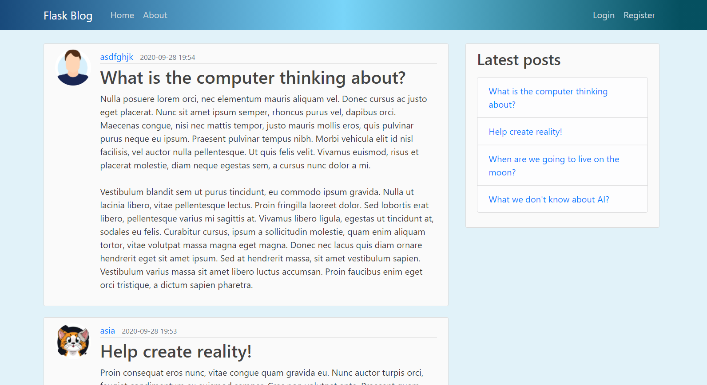

# Flaskblog

Technologies used:
- Python 3.8
- Flask framework
- Bootstrap 4

The Flaskblog application was created to learn about the Flask framework.

The project was based on a YouTube tutorial on the Corey Schafer channel. In addition, the functionality has been enriched with the ability to comment on posts and a side link menu.
The application was placed on the Heroku server.

Functionality:
- creating a user account, changing data, restoring a password
- adding posts, editing posts by the author, commenting on posts
- displaying sorted posts, pagination

You can see a working application on Heroku:
http://mybeautifullflaskblog.herokuapp.com/
